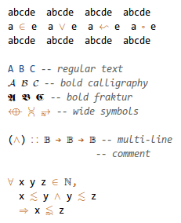
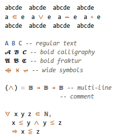
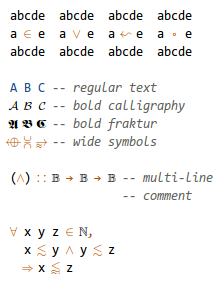

# monospacifier.py

A great way to increase the Unicode coverage of your favorite programming font. Live demo: (using a variable-width fallback font *vs.* using a monospacified fallback font)



## Pre-monospacified fonts (monospace fonts with good Unicode coverage)

Instead of running this program, you can download a pre-generated monospace font with good Unicode coverage, adjusted to your favourite programming font, and use it as a fallback.

Choose the right font from this list, based on your main programming font. For example, if you use Consolas for programming, and you want to use Symbola for symbols, download [*Symbola monospacified for Consolas*](./fonts/Symbola_monospacified_for_Consolas.ttf).

| Programming font     | Monospacified fallback font                                                                                                                                                                                                                                                                                                                                                                                                                                                                                                                                                                                                                                                                                                                                                                                                                                         |
|:---------------------|:--------------------------------------------------------------------------------------------------------------------------------------------------------------------------------------------------------------------------------------------------------------------------------------------------------------------------------------------------------------------------------------------------------------------------------------------------------------------------------------------------------------------------------------------------------------------------------------------------------------------------------------------------------------------------------------------------------------------------------------------------------------------------------------------------------------------------------------------------------------------|
| **Consolas**         | [Asana Math](./fonts/Asana_monospacified_for_Consolas.ttf), [DejaVu Sans](./fonts/DejaVuSans_monospacified_for_Consolas.ttf), [DejaVu Sans Condensed](./fonts/DejaVuSansCondensed_monospacified_for_Consolas.ttf), [DejaVu Serif](./fonts/DejaVuSerif_monospacified_for_Consolas.ttf), [DejaVu Serif Condensed](./fonts/DejaVuSerifCondensed_monospacified_for_Consolas.ttf), [FreeSerif](./fonts/FreeSerif_monospacified_for_Consolas.ttf), [Latin Modern Math](./fonts/LatinModernMath_monospacified_for_Consolas.ttf), [STIX Math](./fonts/STIXMath_monospacified_for_Consolas.ttf), [Symbola](./fonts/Symbola_monospacified_for_Consolas.ttf), [TeX Gyre Schola Math](./fonts/TeXGyreScholaMath_monospacified_for_Consolas.ttf), [XITS Math](./fonts/XITSMath_monospacified_for_Consolas.ttf)                                                                   |
| **DejaVu Sans Mono** | [Asana Math](./fonts/Asana_monospacified_for_DejaVuSansMono.ttf), [DejaVu Sans](./fonts/DejaVuSans_monospacified_for_DejaVuSansMono.ttf), [DejaVu Sans Condensed](./fonts/DejaVuSansCondensed_monospacified_for_DejaVuSansMono.ttf), [DejaVu Serif](./fonts/DejaVuSerif_monospacified_for_DejaVuSansMono.ttf), [DejaVu Serif Condensed](./fonts/DejaVuSerifCondensed_monospacified_for_DejaVuSansMono.ttf), [FreeSerif](./fonts/FreeSerif_monospacified_for_DejaVuSansMono.ttf), [Latin Modern Math](./fonts/LatinModernMath_monospacified_for_DejaVuSansMono.ttf), [STIX Math](./fonts/STIXMath_monospacified_for_DejaVuSansMono.ttf), [Symbola](./fonts/Symbola_monospacified_for_DejaVuSansMono.ttf), [TeX Gyre Schola Math](./fonts/TeXGyreScholaMath_monospacified_for_DejaVuSansMono.ttf), [XITS Math](./fonts/XITSMath_monospacified_for_DejaVuSansMono.ttf) |

If your favorite combination of fonts is not in this list, please let me know.

### Installation

Install the font:

* On Windows put it in `C:\Windows\Font`.
* On Debian-inspired systems put it in `~/.fonts` and run `fc-cache`.

### Fallback font configuration

#### Emacs

Add the following snippet to your `.emacs` (replacing font names as appropriate), then restart:

``` elisp
(set-fontset-font t 'unicode (font-spec :name "<variable-width font> monospacified for <monospace font>") nil 'append)
```

Here are two examples:

``` elisp
(set-fontset-font t 'unicode (font-spec :name "Symbola monospacified for Consolas") nil 'append)
(set-fontset-font t 'unicode (font-spec :name "Asana Math monospacified for DejaVu Sans Mono") nil 'append)
```

#### Other editors

Please submit recipes for other editors or operating systems!

## Details

`monospacifier.py` adjusts every character of your favourite variable-pitch font to match the width of a reference monospace font. The result is an good fallback font to use for characters not covered by the reference font. The final combination (original monospace font + monospacified font as fallback) has good Unicode coverage, and does not break indentation.

`monospacifier.py` includes multiple scaling algorithms. They are all pretty basic; this approach won't work well for anything but a fallback font. The most advanced one (demoed) sets the bounding box of each glyph appropriately, and slightly compresses wide characters to not spill too much from that bounding box. This preserves ratios (so ↦ and ⟼ are still distinguishable), while ensuring that each character occupies one "screen cell". Of course, two consecutive wide symbols will overlap.

## Examples

  

Monospace font + default fallbacks — Monospace font + original Symbola — Monospace font + Monospacified Symbola
